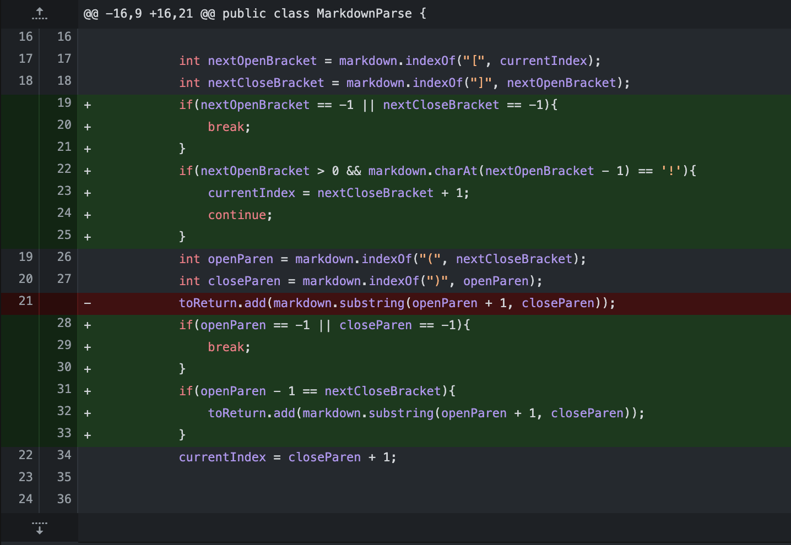
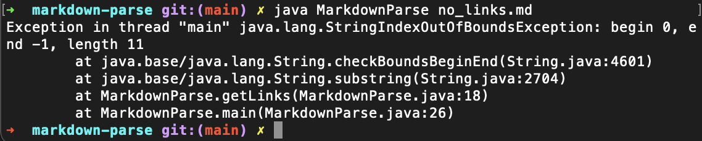
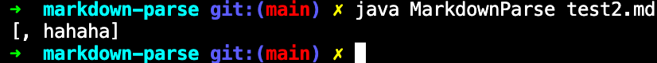

## Lab Report Week 4

Unfortunately, our group did not save each fix for each bug separately. Instead the fixes were all combined together into 1 commit. Since this code also worked for all the test examples after the 2nd test case, there isn't really anything to add.
I will, however, link to the original files that caused these breaks. The files have been renamed to better describe their test cases. The summaries of the issue and the fix are written as best as I could from memory and interpreting backwards from the code.

## [Original test file](test-file.md)

This file had two links, and the program worked for each of these. The original program had several issues however:

1. Images were treated as links, and this was undesirable.
2. Files with brackets `[]` but no parentheses `()` would cause IndexOutOfBoundsException.
3. 
3. Files with separated brackets `[]` and parentheses `()`  would be incorrectly interpreted as links.
4. It was possible for mismatched brackets/parentheses to cause infinite loops.
5. Links on the first line caused infinite loops.
6. Files with neither brackets `[]` nor parentheses `()` would cause IndexOutOfBoundsException.

## [No links](no_links.md)

This was a file that lacked links. The symptom was an IndexOutOfBoundsException. This is because the original code naively took the index of the first bracket and parenthesis using the String.indexOf method. indexOf returns -1 when the search term is not found. Therefore, for a file with no links, it would not find a parenthesis and return -1. The program would then take this index and attempt to pass it to String.substring to add the link to the list. However, since substring throws an IndexOutOfBoundsException for indices < 0, this resulted in the symptom. Therefore, the bug was the lack of validating that a bracket was or wasn't found by checking the value returned from the indexOf method. We added such validation for each of the 4 opening and closing brackets and parentheses to ensure that we only attempted to get a link when all 4 of these elements of a link were found. This also solved many of the other issues, such as mismatching brackets and parentheses.

## [image_link.md](image_link.md)

The symptom was returning a link for a file with only an image. We expect that for an image file there would be no link added, even though the syntax is similar. This occurred because we did not check for an exclamation point before the opening bracket. After adding that, this issue was fixed.

## [test2.md](test2.md)

The symptom here was treating the separated parenthesized text as a link. This was because we did not validate whether or not the closing bracket and opening parenthesis were next to each other, like a proper link. We added one final check at the end of our while loop to do this, and it worked for all the resulting test cases.